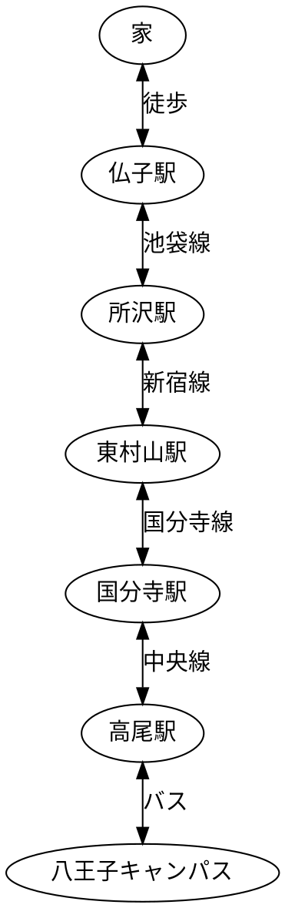

# 鎌田の通学経路

[メンバー表に戻る](member.md#メンバー表)

```graphviz
digraph {
    edge [dir=both]

    家 -> 仏子駅 [label = 徒歩]
    仏子駅 ->所沢駅 [label = 池袋線]
    所沢駅 -> 東村山駅 [label = 新宿線]
    東村山駅 -> 国分寺駅 [label = 国分寺線]
    国分寺駅 -> 高尾駅 [label = 中央線]
    高尾駅 -> 八王子キャンパス [label = バス]

    
}
```
